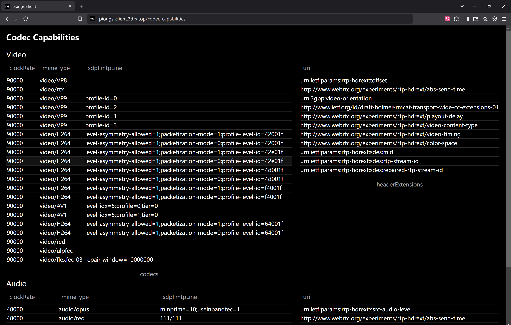

# VaporPlay

Cloud-game server & client based on Linux and Pion WebRTC.

> This project is originally not intended to be production-ready, it's ment to be used for reasearch and testing purpose.
But all kinds of PR's are welcomed, thanks for checking out this project.

## Environment & Limitations

The server can only be compiled & run on Linux using X11 and have steam installed, the client runs in browser.
Currently, only transportation of game video and controller inputs is implemented.
Due to the proof of concept & test bed nature of this project, other types of payload is not planned for now.
The control input transportation and processing is tested on Xbox Wireless Controller.
Also, for the nvenc hardware encoder to work, a nvidia graphics card and it's driver is required.

### Build FFmpeg from source

This project's Makefile use a FFmpeg build from source, but doesn't handle the dependency installation and configuration for you.

Since we use nvenc, it's required to install https://github.com/FFmpeg/nv-codec-headers.

## Configuration

All configurations is in `config.json`.
Here is an explanation of what each entry in a game config means:
- `game_id`: steam game ID, used to start game with command.
- `game_window_name`: used to match and find the correct window using X11 library, need to be a substring of the window name to be matched.
- `game_display_name`: name to shown in client.
- `game_icon`: for future UI improvement, leave empty for now.
- `game_process_name`: names of processes that need to be terminated after session ends.

## Usage

0. Install dependencies.
1. Run `make` to build, first time running this will also fetch FFmpeg source code and build it.
2. To start server, run `./vaporplay -config=config.json`. For profiling, run `./vaporplay -config=config.json -cpuprofile=vaporplay.prof`
and after server exits, run `go tool pprof vaporplay vaporplay.prof`, and type `web` to see the profile.
3. After server started, go to the address in configuration file (default to `http://0.0.0.0:8080`).
4. Click next, choose a game, and start!

Other commands
- `make clean` Clean build cache.
- `make clean-deps` Remove installed && build artifacts (will result in next `make` to take longer).

### Testing Input Device

vaporplay-client includes a controller testing tool at https://vaporplay-client.3drx.top/gamepad-test.

It also includes the detection of codec capabilities at https://vaporplay-client.3drx.top/codec-capabilities.

> During development, only Xbox Wireless Controller is tested.

## Acknowledgements

1. https://github.com/pion
2. github.com/bendahl/uinput and it's fork github.com/ThomasT75/uinput for the uinput implementation in go
3. https://github.com/asticode/go-astiav for the FFmpeg binding
4. FFmpeg
